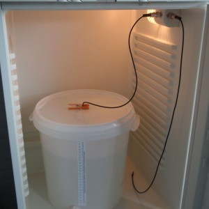

!SLIDE smaller center

## The Next Generation of Makers ##
### Clockwork unConference 2013 ###

!SLIDE center smaller
# What is it? #
* Similar in concept to Open Source Software
* Hardware design artifacts are freely available:
    * Mechanical drawings 
    * Schematics
    * Printed Circuit Board (PCB) and Integrated Circuit (IC) layouts
    * Source code

* Licensed and released with the same Free and Open-Source Software approach: 
  Anyone may use, make, modify, redistribute the hardware designs, source code, etc. 

!SLIDE center small
## "Free software is a matter of liberty, not price. To understand the concept, you should think of free as in free speech, not as in free beer." ##
### - Richard Stallman ###

!SLIDE center small
## BrewPi ##
### An open source project using a Raspberry Pi and Arduino to control and monitor fermenting! ###

!SLIDE center smaller incremental
# But Hardware Costs... #

* Open Source Hardware Central Bank
* Contests by Hardware Vendors
* But probably you will need buy something...so the challenge is making it affordable!

!SLIDE small
# Common Hardware #

!SLIDE smaller
# Arduino #
* Open Source single board microcontroller
* Based on the electronics prototyping platform, Wiring
* 8-bit Atmel AVR processors (ATmega8, ATmega168, ATmega328, ATmega1280, and ATmega2560)
* Programmed using a language similar to C/C++
* 14 digital I/O pins (6 with PWM), 6 analog inputs
* Add on hardware called shields

!SLIDE 
## Form Factors to Fit Many Functions ##

!SLIDE smaller incremental
# Raspberry Pi #
* Goal of the project is to provide students (as young as elementary school!) with their own computer to learn programming and other hackery
* Recommended OS is a fork of Debian called Raspbian
* They promote learning programming with Python and Sketch
* "We can get UNIX boxes in the hands of kids for $35." - Rob Bishop

* Jachin will show you more pi in a bit!

!SLIDE center bullets 
# My Hacking History #

