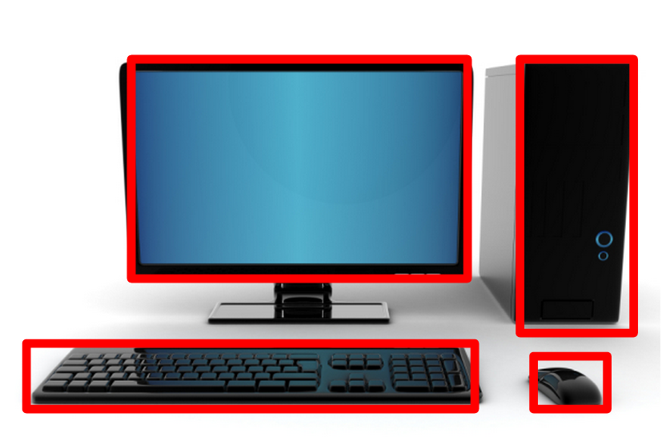
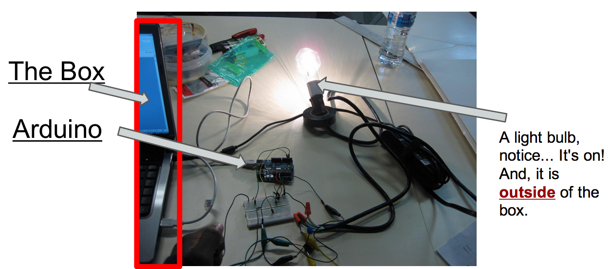

!SLIDE

# Blame Andy for the following slides... #

!SLIDE bullets incremental transition=fade
# Thinking Outside The Box #
* Good engineers are taught to think outside the box.
* Come up with new and innovative ideas.
* What is the "Box"

!SLIDE
#The Orthodox Box...#
* Is Traditional Ways
* Common Ways

!SLIDE
#Engineers#
* Software Engineers
 
 

 
... and these are our tools.

!SLIDE bullets incremental transition=fade

# Boxes #

 
Do you see the problem here?

!SLIDE
Not my picture, but you get the point.
 

!SLIDE

Arduinos allow you to use software to interact with the physical world!

Because we all know that software interacting with the physical world is so much more easier than, say, using our arms.
