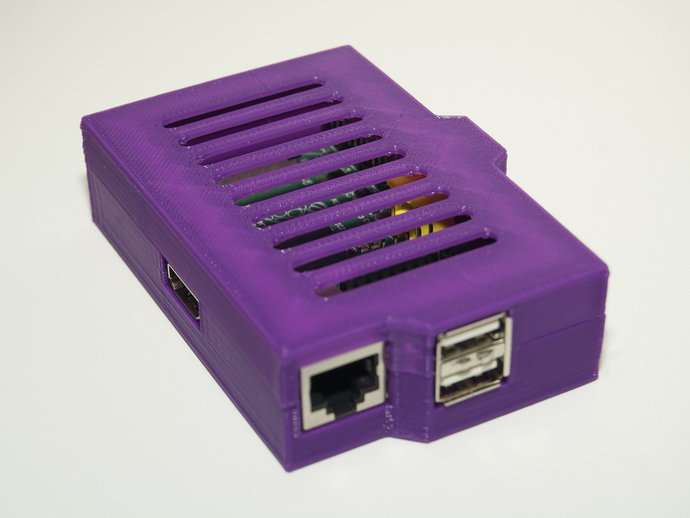

!SLIDE

# It's a computer. #

!SLIDE bullets

* **Processor:** 700 MHz ARM1176JZF-S core
* **Video:** Broadcom VideoCore IV, OpenGL ES 2.0, MPEG-2 and VC-1 (with license), 1080p30
  h.264/MPEG-4 AVC high-profile decoder and encoder
* **RAM:** 256MB (or 512MB)
* **USB:** 2 2.0 Ports
* **Cost:** $35 USD

!SLIDE  full-page

!SLIDE full-page

!SLIDE

<!---->

!SLIDE full-page

!SLIDE

# No Case.. #

## but Alex **Barratt** Made one for me though with his... ##

# 3D Printer #

!SLIDE

# Thanks Barratt #

!SLIDE

# Should I get a Raspberry PI? #

!SLIDE

# Yes, you should get a Raspberry PI. #

* Great way to learn about computers and programming.
* Espshally for kids.
* Do you have a TV? Try XBMC.
