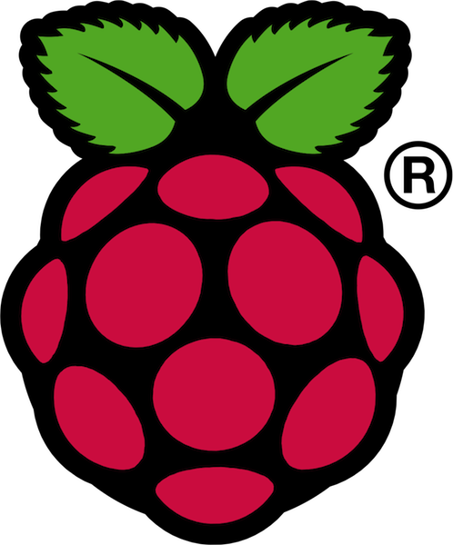
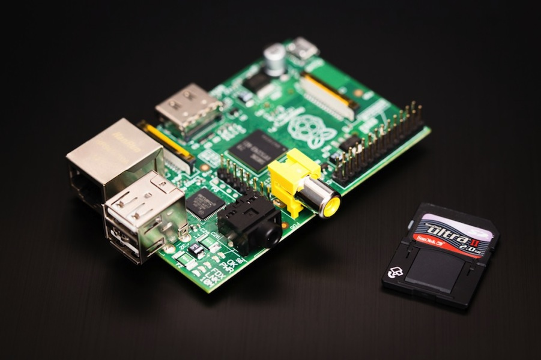
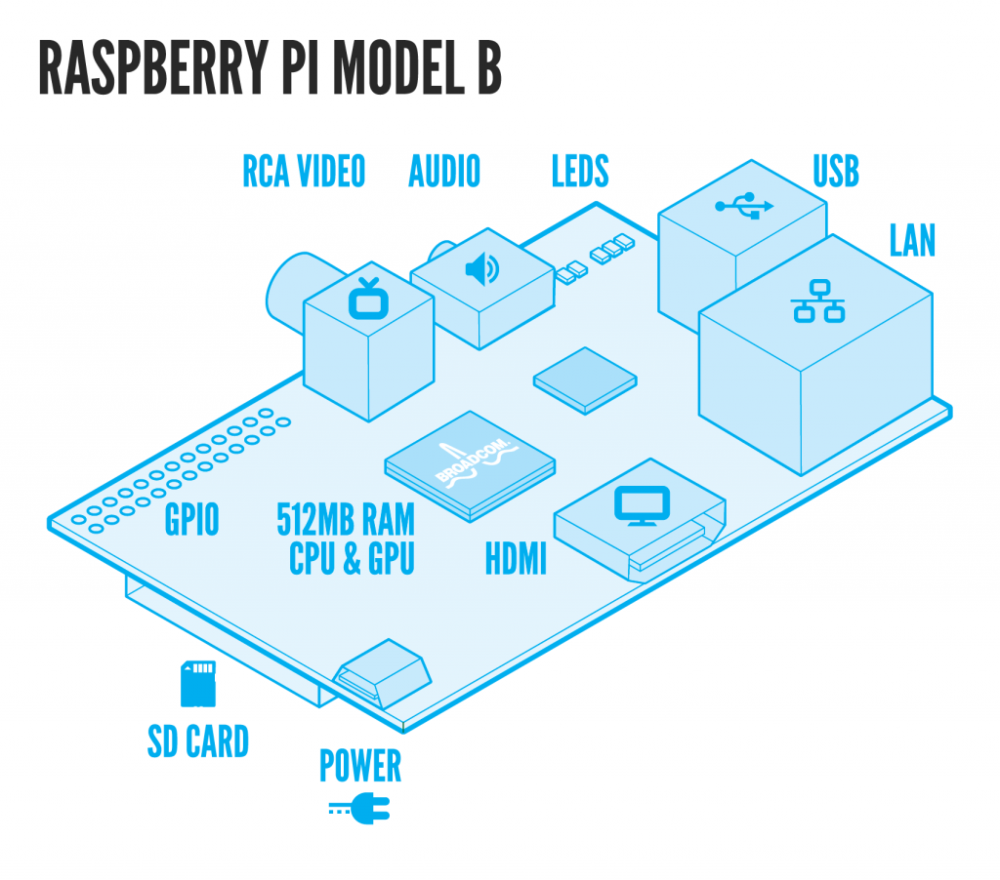
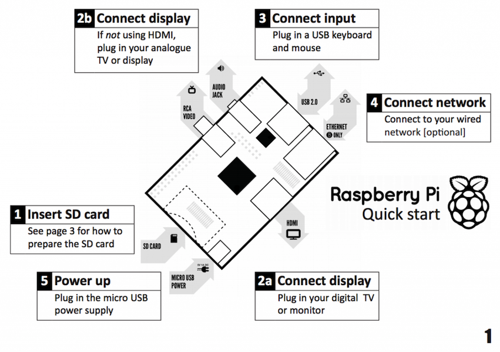

!SLIDE

# It's a computer. #

!SLIDE bullets

* **Processor:** 700 MHz ARM1176JZF-S core
* **Video:** Broadcom VideoCore IV, OpenGL ES 2.0, MPEG-2 and VC-1 (with license), 1080p30
  h.264/MPEG-4 AVC high-profile decoder and encoder
* **RAM:** 256MB (or 512MB)
* **USB:** 2 2.0 Ports
* **Cost:** $35 USD

!SLIDE full-page

!SLIDE full-page

!SLIDE full-page

!SLIDE full-page

!SLIDE

# Should I get a Raspberry PI? #

!SLIDE bullets incremental transition=fade

# Yes, you should get a Raspberry PI. #

* Great way to learn about computers and programming.
* Espshally for kids.
* Do you have a TV? Try XBMC.